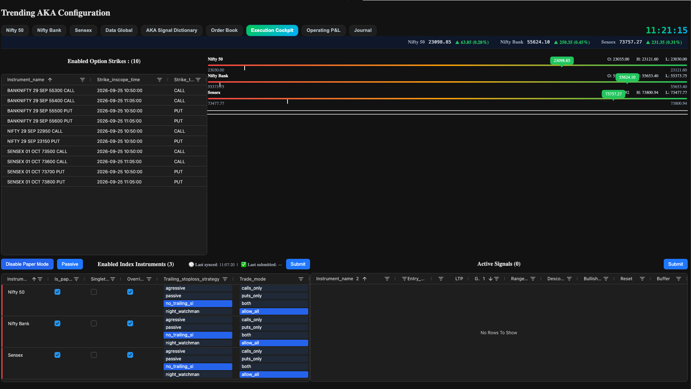
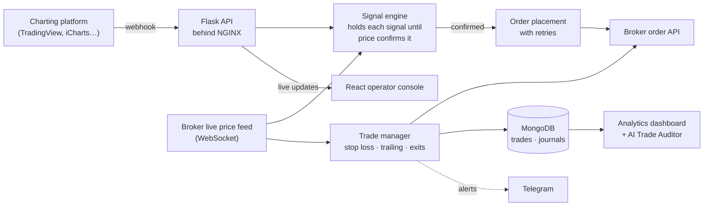
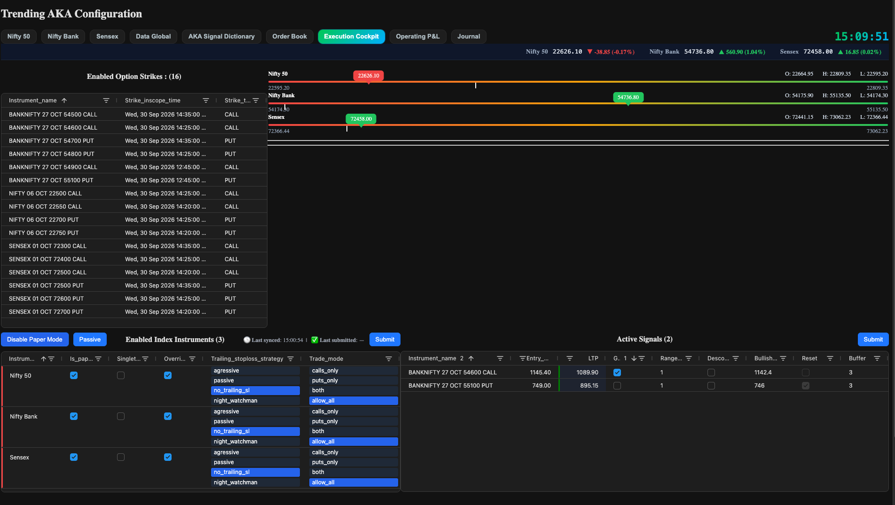
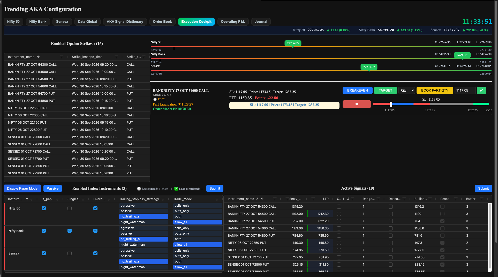
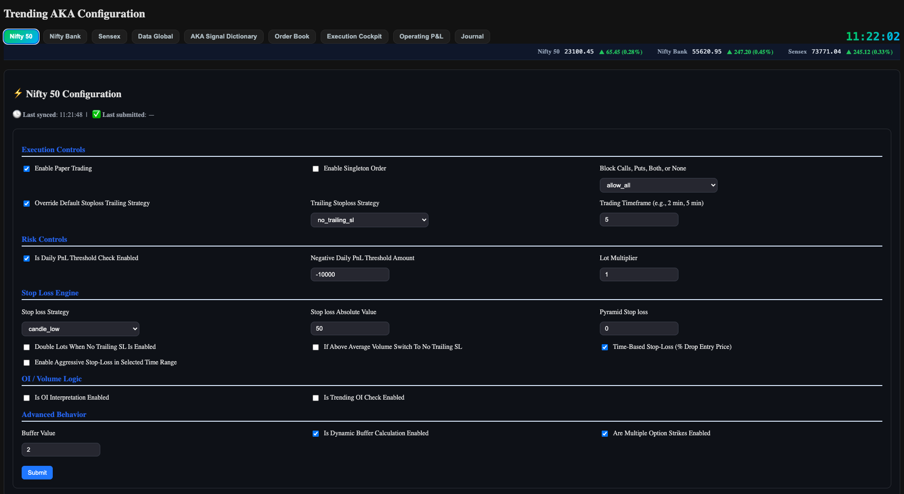
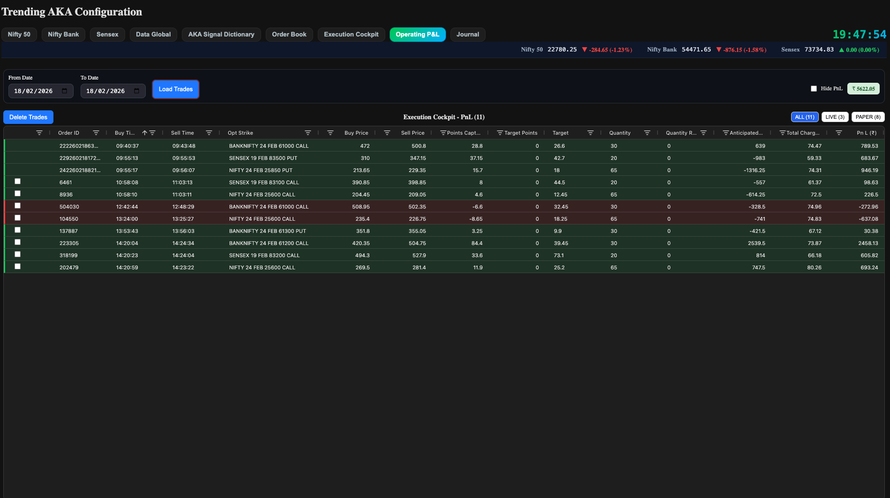

# scalping-engine — architecture and design write-up

**How I built an automated scalping engine for NSE/BSE index options: live
execution, risk controls, trade journaling and an AI trade auditor.**

**scalping-engine** is an automated intraday trading engine for Indian index
derivatives on NSE and BSE. A chart raises a signal. The engine watches the live
market, decides whether and when to act on it, places the order, and manages the
trade until it is closed. Every trade is then logged, journaled and analysed.

---

## What this repository is

A public write-up of how the engine was designed and built. The source code is
private, because it is a working trading system.

**It contains:** what the engine does, how it is put together, the risk controls,
and the analytics and AI review that sit on top of it.

**It does not contain:** source code, the signal logic, or strategy parameters.

---

## The problem it solves

Scalping means taking many small, fast trades in a single day. Doing it by hand
means watching several charts, reacting within seconds, placing the order,
setting a stop loss, moving it as the price moves, and getting out on time. All
of it under pressure.

People are bad at this. They hesitate on entries, move stop losses when they
shouldn't, hold losers too long and cut winners too early.

The engine takes execution away from the human. The trader sets the rules once,
in configuration. The engine applies them the same way on every trade.

---

## The core idea: the chart decides what, the engine decides when

The work is split in two, on purpose.

**The chart raises the signal.** Any charting platform like TradingView, iCharts
etc. could be used to trigger the signal. When a setup forms, the chart sends a
short message to the engine with the price levels that matter. It is sent by
webhook, meaning the chart calls a web address on the engine the moment the
alert fires.

**The engine decides whether and when to act.** A signal is not an order. The
engine holds it and watches the live price. It only enters when the price
confirms the setup, and only if every risk check passes at that moment. If the
setup is cancelled first, the signal is dropped.

Because of this split, the signal can be changed, or moved to a different chart
platform, without touching the execution code. And a bad signal still has to get
past the engine's risk checks before it can cost money.

---

## Scan wide, accept narrow

This is the most unusual part of the design.

A scalper wants the option contracts closest to where the index is trading right
now, the "at-the-money" strikes. But that changes all day. When the index moves,
yesterday's best strike is no longer the right one. Chart alerts can't be moved
to new strikes automatically, and setting them up again by hand during the day
isn't practical.

So the scanning and the choosing are done in different places:

1. **The chart scans everything.** A single TradingView watchlist alert covers
   about 500 option strikes, calls and puts, across all three indices. The
   indicator runs on every one of them at the same time, and sends a webhook
   whenever any of them forms a setup.
2. **The engine chooses.** It keeps its own short list of at-the-money strikes,
   picked from the live index price and updated as the index moves. A signal is
   accepted only if it is for a strike on that list. Everything else is ignored.

The chart never needs to know which strikes matter right now. The engine never
needs to watch 500 charts. And when the index moves, the engine switches strikes
on its own, with nothing to reconfigure on the chart.

Two small Chrome extensions keep the chart side running:

- **Watchlist refresh.** Rebuilds the watchlist around the current index levels.
  It adds strikes for the new expiry, and removes expired strikes and strikes
  that have drifted too far from the index. One click, with a dry run first to
  preview the changes.
- **Strike sync.** Every 15 minutes during market hours, it points six
  TradingView charts (a call and a put for each index) at the strikes the engine
  is currently watching. It doesn't affect signals. It just saves changing six
  charts by hand.

---

## How it fits together

Every price update from the broker goes through the same fixed sequence. Open
trades are managed first. Then waiting signals are checked. Then the engine
decides which contracts to watch, adds to winning positions, looks for re-entry
chances, and updates the screens.

Open trades always come first. Protecting money already at risk matters more
than finding the next trade.

Full detail: **[docs/architecture.md](docs/architecture.md)**

---

## What it trades

What it trades is set in configuration, not written into the code.

| | |
|---|---|
| Markets | NSE and BSE derivatives |
| Indices configured today | NIFTY 50, NIFTY BANK, SENSEX. Others are supported. |
| Instruments | Configurable. The current setup trades index options. |
| Style | Intraday only. Everything is closed by the end of the session. |
| Session | 09:15 to 15:30 IST |

Each index has its own settings: position size, stop-loss method, trailing
method, which side is allowed (calls, puts or both), and a daily loss limit.
These can be changed while the market is open, from the operator console.

---

## Risk controls

Every time it starts, the engine is in **paper trading**. It simulates orders
without sending them to the broker. Real trading has to be switched on
deliberately, one index at a time.

On top of that there is a daily loss limit, which switches an index back to paper
trading when hit. A profit lock raises that limit as the day goes well. Only one
position per index can be open at a time. And Telegram sends an alert on every
entry and exit.

Full detail: **[docs/risk-controls.md](docs/risk-controls.md)**

---

## Analytics and the AI Trade Auditor

This is what turned a trading bot into something that makes the trader better.

Every closed trade is saved with its prices, charges and slippage (the gap
between the price the engine wanted and the price it got). The trader then fills
in a short journal for it: how closely they followed their rules, why they took
it, how they exited, and how they felt at exit.

The analytics dashboard puts the two together. It shows not just whether the
system made money, but which behaviours lost money and how much. The AI Trade
Auditor then reads those computed numbers and writes a short, neutral finding.
For example, the single change that would cut losses the most.

Full detail: **[docs/analytics.md](docs/analytics.md)** and
**[docs/ai-trade-auditor.md](docs/ai-trade-auditor.md)**

---

## The stack

| Layer | Built with |
|---|---|
| Engine | Python, Flask, Flask-SocketIO, gevent, pandas, NumPy, TA-Lib |
| Market data and orders | Broker APIs: WebSocket live price feed, REST order placement |
| Signals | Any charting platform with webhook alerts. TradingView today, with one watchlist alert. |
| Chart tooling | Two Chrome extensions in JavaScript: watchlist refresh and strike sync |
| Operator console | React, Vite, AG Grid, Socket.IO |
| Analytics dashboard | Streamlit, Plotly |
| AI | OpenAI models, given pre-computed statistics |
| Database | MongoDB |
| Alerts | Telegram bot |
| Running it | AWS EC2, NGINX |
| Written in | Anaconda and the Spyder IDE, by hand. From October 2025, Cursor 2.0 with its Composer model. |

---

## Scale

| | |
|---|---|
| Commits since December 2024 | about 1,150 |
| Python in the engine | about 12,700 lines |

---

## What it looks like

**Execution cockpit** (shown at the top of this page). The live view during
market hours. On the left, the contracts the engine is watching and when each
was picked. On the right, where each index is trading within its range for the
day. At the bottom, the controls for each index and any signals waiting for
confirmation.

**Execution cockpit with active signals.** Signals the engine has raised and is
tracking, before any order has been placed.

**Execution cockpit with a live order.** The full view once the engine has
placed an order, with the live position shown alongside the signals.

**Index configuration.** Every rule the engine follows for one index, changeable
while the market is open: paper or real trading, the daily loss limit, position
size, stop-loss method and trailing method.

**Operating P&L.** One day's trades, real and paper, with entry and exit times,
prices, charges, and the net profit or loss for each.

More screens in **[docs/analytics.md](docs/analytics.md)**.

> The screens show the name "Trending AKA". That is the name the engine is set
> up under for personal use.

---

## Documents

| | |
|---|---|
| [Architecture](docs/architecture.md) | Components, the live price loop, the path from signal to trade |
| [Risk controls](docs/risk-controls.md) | Every check between a signal and real money |
| [Analytics](docs/analytics.md) | The trade journal and the analytics dashboard |
| [The AI Trade Auditor](docs/ai-trade-auditor.md) | How the AI review is built and how the pieces fit together |

---

## A note on what's here

The write-up is public so the engineering can be read and discussed. The engine's
source code and signal logic are not published.

The engine can be shown running live during Indian market hours, 09:15 to 15:30
IST.

Written by **Amit Kumar Aswani** — [LinkedIn](https://www.linkedin.com/in/amit-kumar-aswani)
