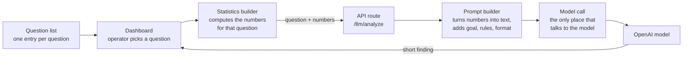

# The AI Trade Auditor

How the AI review is built, and how the pieces fit together.

---

## What it does

The operator picks a question in the analytics dashboard and clicks a button. A
few seconds later, a short, neutral finding appears. It is based on their own
trades and journal entries.


---

## The rule it is built on

**The numbers are worked out in code. The AI only writes them up.**

A language model is good at spotting a pattern in a summary and saying it
clearly. It is not reliable at counting, averaging or comparing hundreds of
rows. So the model is never given that job.

For every question, the code computes the statistics first. The model receives
only that short summary. It never sees the raw list of trades and it is never
asked to do arithmetic. The one exception is the rule-violation question, which
also sends the operator's own short notes. Every number in its answer can be
checked against the dashboard.

---

## How the pieces fit together



There are five pieces. Each one has a single job.

### 1. The question list

One list holds every question the auditor can answer. Each entry has:

- the label shown in the dashboard
- the question itself, in plain words
- the instructions for the model on this question
- which statistics builder to use
- which prompt builder to use
- the maximum length of the answer, in lines

Adding a new question means adding one entry to the list, plus its two builders.
Nothing else in the chain changes.

### 2. The statistics builder

There is one per question. Each takes the operator's journaled trades for the
selected dates and filters, and reduces them to the handful of numbers that
question needs.

| Question | What the builder works out |
|---|---|
| Execution consistency | Average execution score and share of low scores, by trade type and by time of day |
| Rent efficiency | How often rent was cheap, acceptable or expensive, and what behaviour came with the expensive kind |
| Rule violations | The operator's own violation notes, grouped by trade type |
| Behavioural drift | The same measures for this period and the period of the same length just before it |
| Single behavioural focus | Among expensive-rent trades: emotional state, exit behaviour and trade type, counted |
| Left tail structure | The spread of the worst losses, week by week, over the last four trading weeks |

This runs inside the dashboard, where the filtered data already is. Only the
result is sent on.

### 3. The API route

The dashboard sends the question name and the computed numbers to one route on
the engine's API. The route checks the question is on the list, and refuses it
if not. It then looks up that question's prompt builder and instructions.

### 4. The prompt builder

There is one per question. It turns the numbers into short lines of plain text,
then adds three things:

- **the goal**, such as "identify the single behavioural correction that would
  most reduce avoidable drawdown"
- **the rules**, such as "recommend exactly one change", "no motivational
  language", "no strategy advice"
- **the output format**: a fixed heading, and a hard limit on length

### 5. The model call

Every request to the model goes through one function. Nothing else in the
codebase talks to the model directly.

That function reads the model name from settings, so the model can be changed
without touching code. The default is a small, cheap model, gpt-5-mini. It also
sets a cap on the length of the reply and a timeout. It only sends settings that
the chosen model accepts, since smaller models reject some of them.

Keeping this in one place means changing provider or model is a change to one
file.

---

## The instructions to the model

Each question has its own instructions, but they share the same shape:

- **Role:** a neutral trading behaviour auditor.
- **What it must not do:** coach, advise, motivate, console, or judge. No
  strategy advice.
- **What it must do:** compress the numbers into a finding. Separate patterns
  that keep recurring from one-off cases.
- **Tone:** factual, unemotional, and not swayed by whether the trades made
  money.

The questions that ask for a recommendation are told to give exactly one. A
single clear finding gets acted on. A list of five gets read and forgotten.

---

## One example, end to end

The screenshot above shows a real run of the *single behavioural focus* question
on February 2026.

**What the code worked out and sent** (shortened):

```
Expensive rent trades: 54
Low execution trades (score ≤5): 59

=== Exit discipline in expensive rent ===
- Hesitated / overpaid rent: 51
...
=== Emotional state in expensive rent ===
- Frozen / delayed: 19
...

Objective: identify the single behavioural correction that would most reduce
avoidable drawdown.
Rules: exactly one focus. No motivational language. No strategy changes.
```

**What the model wrote back:** stop hesitating on exits. Act the moment the exit
is decided. It pointed to 51 of 54 expensive losses marked as hesitation, 19 with
a frozen emotional state, and 59 trades with low execution scores.

Every number in that answer was in what the code sent. The model found the
pattern and said it in one sentence.

---

## Why build it this way

**Answers can be trusted.** The numbers come from code that can be tested and
checked against the dashboard, not from the model.

**It is cheap.** The model receives a few lines of summary, not months of trades,
so a small model is enough and each question costs very little.

**It is easy to extend.** A new question is one list entry and two small
builders.

**It can't drift into advice.** The rules are written per question, and the
answer length is capped.

This was the first version of an idea later rebuilt properly in
[tradeself](https://github.com/amitkaswani/tradeself-architecture): the AI
explains the evidence, it doesn't produce it.
