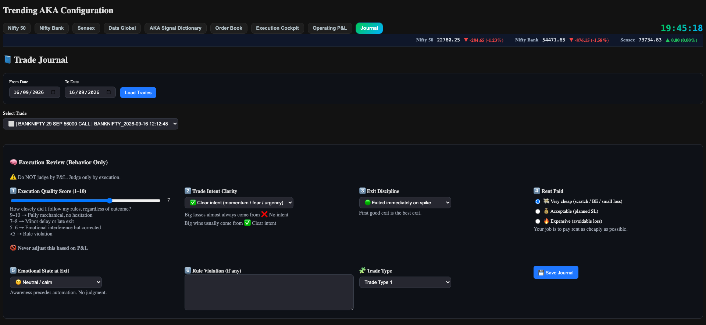
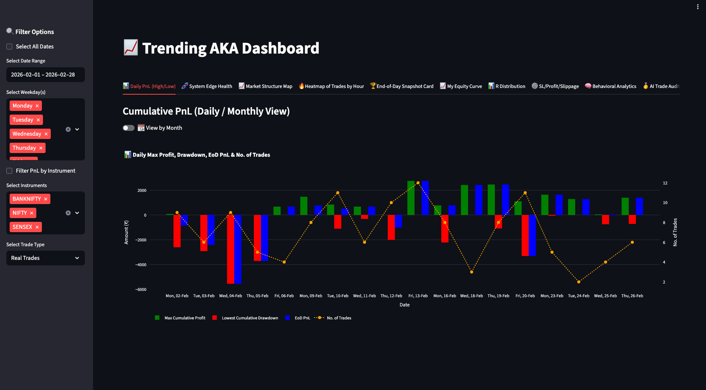
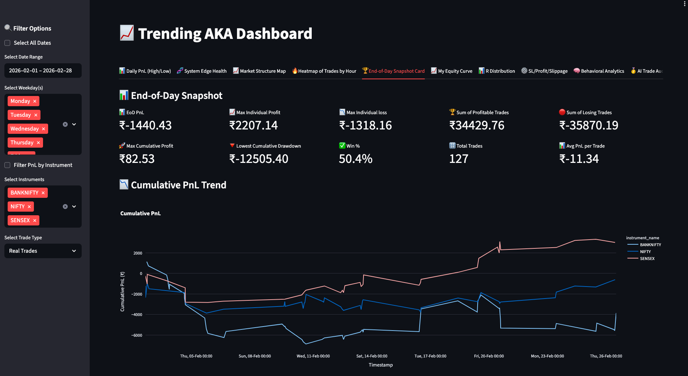
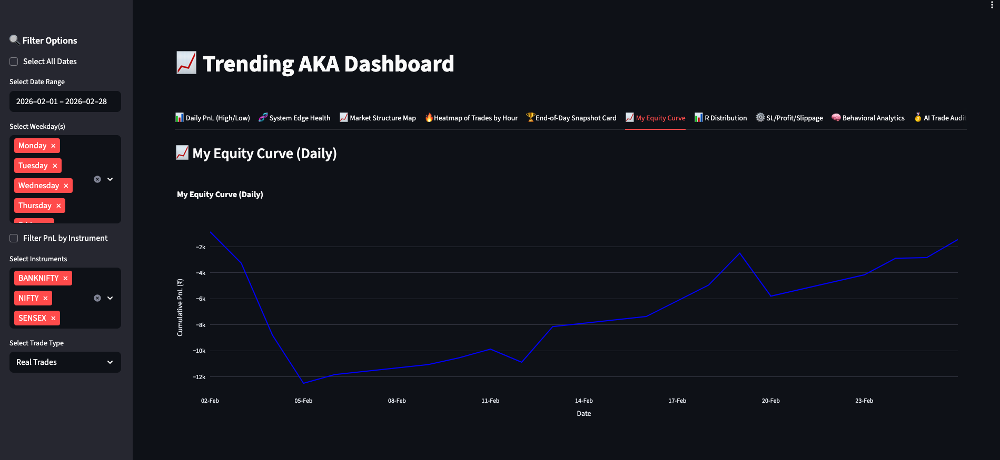
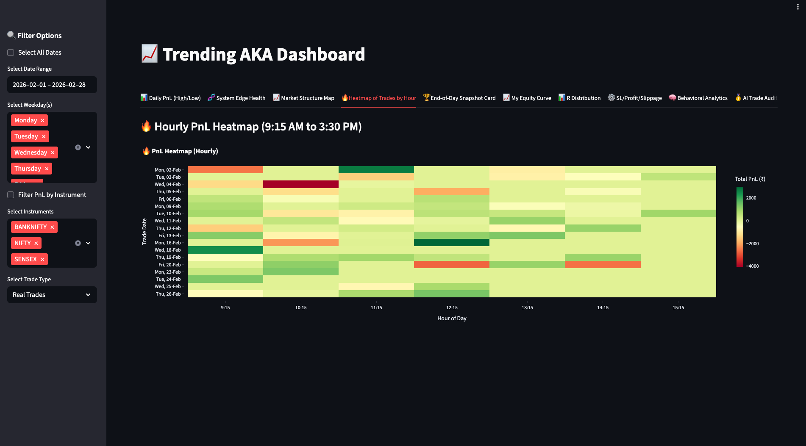
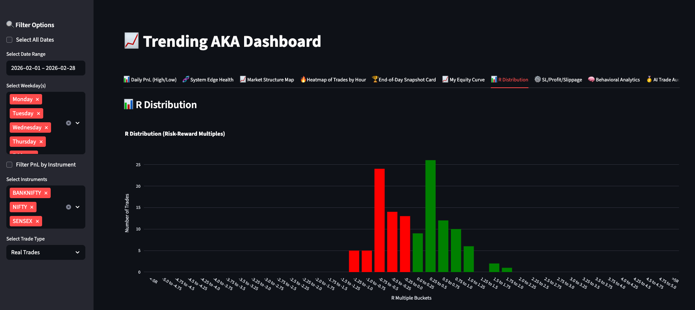
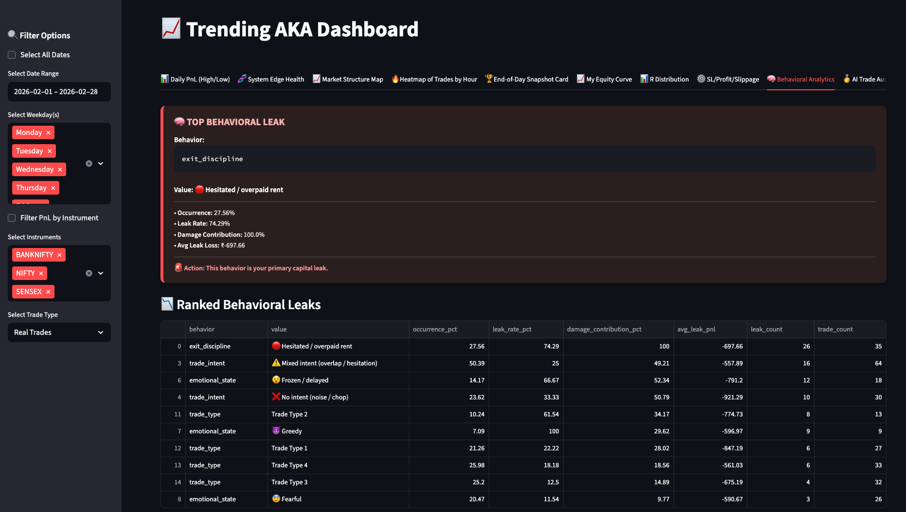
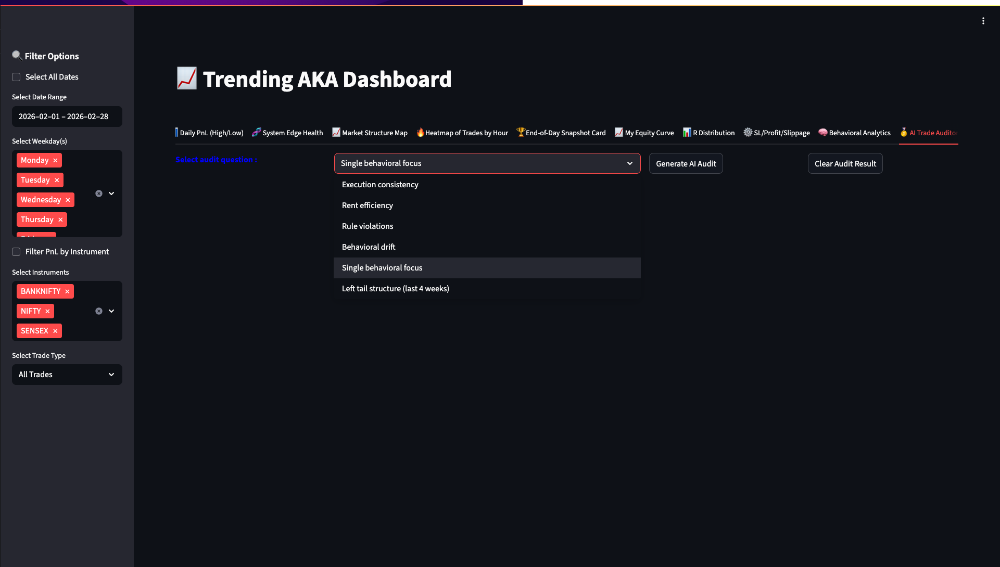
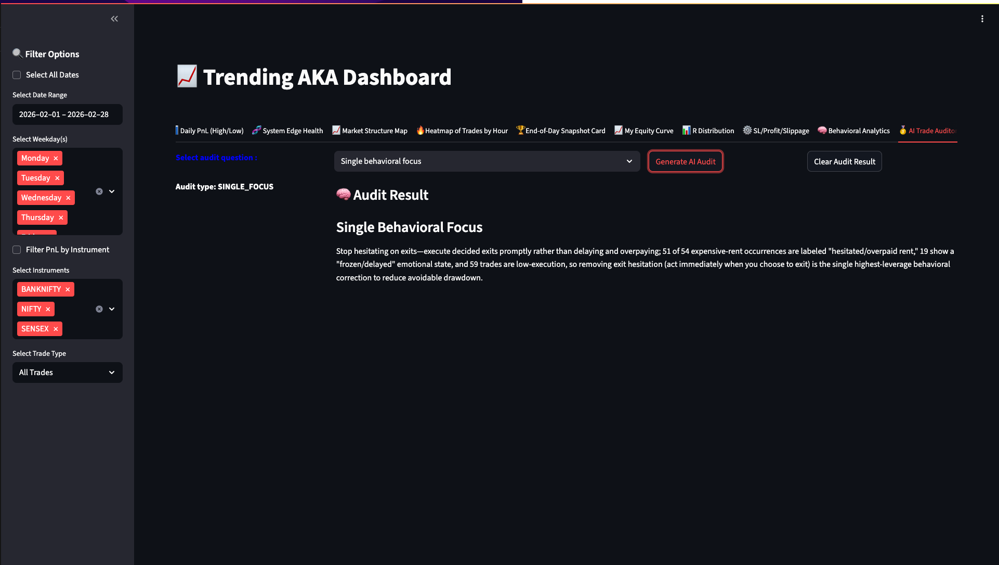

# Analytics and the AI Trade Auditor

The engine takes the trades. This part answers the harder question: **is the
system actually working, and when it loses, is that the system or the person
running it?**

---

## Why this exists

An automated engine removes most of the human from the trade. Not all of it. The
operator still decides when to switch to real money, still overrides stop losses,
still exits early by hand, still changes settings in the middle of the day.

Those decisions are where money quietly leaks. Profit and loss alone can't show
it. A losing trade might be the system doing exactly what it should in a bad
market. It might also be the operator panicking and exiting too early. The two
look the same in the P&L.

So the analytics are built on two sources, not one:

1. **What happened.** Every trade the engine closed, with prices, times, charges
   and slippage (the gap between the price the engine wanted and the price it
   got).
2. **How the operator behaved.** A short journal filled in for each trade.

---

## The trade journal

Every closed trade gets a blank journal entry automatically. The operator fills
it in afterwards. The questions are fixed choices, not free text, so the answers
can be counted and compared.

| Question | What it captures |
|---|---|
| Execution quality, 1 to 10 | How closely the rules were followed, whatever the result. 9–10 means fully mechanical, below 5 means a rule was broken. |
| Trade intent | Was there a clear reason for the trade, a mixed one, or none? |
| Exit discipline | Exited cleanly, or hesitated and gave money back? |
| Rent paid | Was the loss cheap, acceptable, or expensive and avoidable? |
| Emotional state at exit | Calm, fearful, greedy, frozen |
| Trade type | Which kind of setup it was |
| Rule violation | A short note, only if a rule was broken |

The screen says it plainly: *do not judge by P&L, judge only by execution.* A
losing trade taken by the rules scores well. A winning trade taken on impulse
does not.

**"Rent"** is the idea underneath this. In scalping, some losses are the cost of
being in the market, like rent. The aim isn't zero losses, it's paying as little
rent as possible. A small loss at a planned stop loss is cheap rent. A large loss
from hesitating is expensive rent.

---

## The analytics dashboard

Built in Streamlit and Plotly. It reads every saved trade and journal from
MongoDB. Everything can be filtered by date range, weekday, index, and real or
paper trades.

It has eleven views. The main ones:

### Daily P&L

For each day: the best point reached, the worst drawdown, where the day ended,
and how many trades were taken. It shows at a glance whether good days are being
given back, and whether bad days come with too many trades.

### System edge health

Week by week: expected profit per trade, win rate against loss rate, and average
win against average loss. This is the early warning. Several negative weeks in a
row, or a cumulative line going flat, means the market has changed and the
system's edge is fading.

### End-of-day snapshot

The period in one card: total P&L, largest single win and loss, total from
winners and from losers, lowest drawdown, win rate, number of trades, and
average P&L per trade. Below it, the running P&L for each index.

### Equity curve

Running P&L day by day. The shape matters more than the end number: how deep
the drawdowns go and how long recovery takes.

### Heatmap by hour

P&L for every hour of every day, from 09:15 to 15:30. It shows which parts of
the session make money and which lose it, so trading can be switched off in the
hours that don't work.

### R distribution

"R" is the profit or loss on a trade divided by the risk taken on it. A trade
that risked ₹100 and made ₹200 is +2R. The chart shows how many trades landed
in each band. A healthy scalping system loses small and often, and wins bigger
less often. This chart shows whether that is actually happening.

### Stop loss, profit and slippage

Average stop loss, average win, average loss and average slippage, for each
index. Slippage that keeps growing means the orders are too slow, or the
contracts being traded are too thin.

### Market structure map

Each trade plotted against the market conditions reported with its signal,
with the bubble size showing the profit or loss. It shows which market
conditions the system does well in.

### Behavioural analytics

This is where the journal pays off.

A trade counts as a **leak** when three things are all true at once: it lost
money, the operator marked it as expensive rent, and the execution score was 5
or below. That is a loss the operator caused, not the market.

For every journal answer, such as "hesitated on exit" or "felt frozen", the
dashboard works out:

- how often it happens
- how often it ends in a leak
- what share of all leak losses it caused
- the average loss when it does

It then ranks them and names the top one.

In the month shown, the top leak was hesitating on exit. It came up in just over a
quarter of trades. Three out of four of those trades turned into leaks. And it
was part of every leak in the month. That is a specific, fixable habit, found
from the operator's own records.

---

## The AI Trade Auditor

The last view. The operator picks a question, and an AI model answers it from
the journal data.

| Question | What it asks |
|---|---|
| Execution consistency | Where does execution quality drop, by trade type and time of day? |
| Rent efficiency | Where is rent consistently overpaid, and what behaviour comes with it? |
| Rule violations | What themes keep coming up in the rule-violation notes? |
| Behavioural drift | Compared with the previous period, what has got worse? |
| Single behavioural focus | What one change would cut losses the most? |
| Left tail structure | Over the last four weeks, are the worst losses getting worse? |

### How it works

**The numbers are worked out first, in code. The AI only writes them up.**

For each question, the engine first computes the statistics itself: counts,
averages, how answers are spread across trade types and times of day. Only that
summary is sent to the model. It never sees the raw trade list, and it is not
asked to do any arithmetic. The one exception is the rule-violation question,
which also sends the operator's own short notes.

So every number in the answer came from the code, and can be checked against the
dashboard. The AI's job is to find the pattern in numbers that are already
correct, and to say it in one or two sentences.

**The model is told what it is not allowed to do.** Each question has its own
instructions. The model is a neutral auditor. It does not coach, motivate or
judge. It must stay factual and not react to whether the trades made money.
Where a question asks for a recommendation, it must give exactly one.

This was the first version of an idea later rebuilt properly in
[tradeself](https://github.com/amitkaswani/tradeself-architecture): the AI
explains the evidence, it doesn't produce it.
