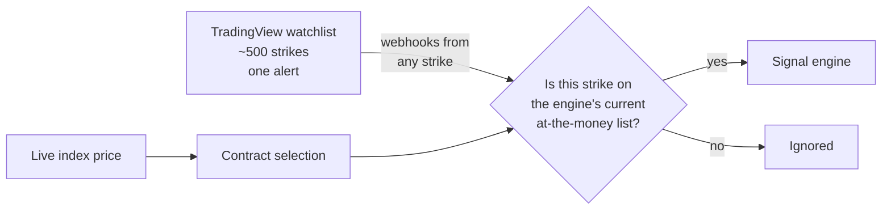
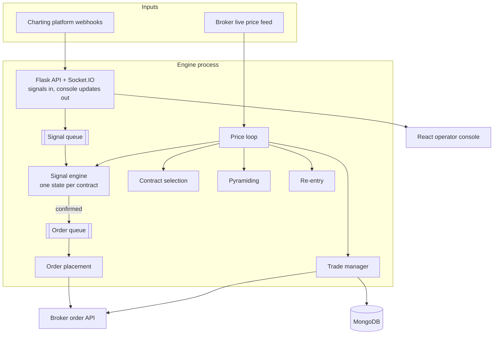
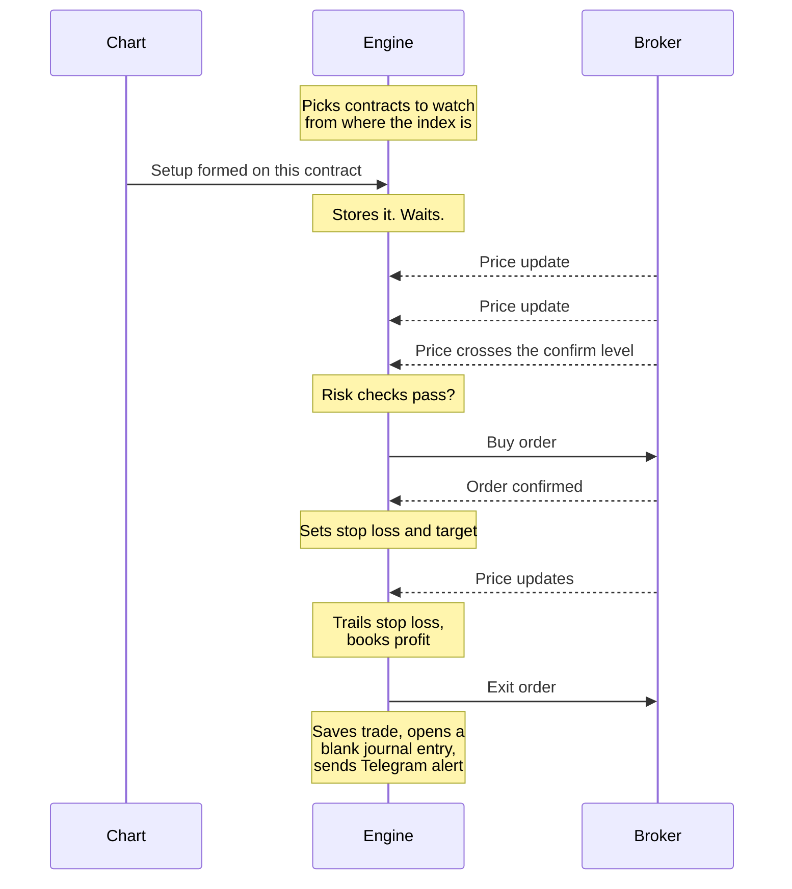

# Architecture

How the engine is put together, and why.

---

## Two inputs, one decision

The engine listens to two things at once.

1. **Signals from a chart.** Any charting platform like TradingView, iCharts etc.
   could be used to trigger the signal. The chart sends a webhook, a short
   message to a web address on the engine, when a setup forms. It sends another
   when the setup is cancelled.
2. **Live prices from the broker.** A continuous stream of price updates for
   every contract the engine is watching, over a WebSocket connection.

A signal on its own does nothing. It is stored and waits. The decision to trade
is made on a price update, when the live price confirms the waiting signal.

This is the most important design choice in the engine. The chart is good at
spotting a pattern. It is slow and imprecise about the exact moment to act,
because it only knows about completed candles. The engine sees every price
update, so it can act on the exact moment the level is crossed.

---

## Scan wide, accept narrow

The chart side and the engine side each do the part they are good at.

**The chart scans a wide net.** One TradingView watchlist holds about 500 option
strikes, calls and puts, across all three indices, spread either side of where
each index is trading. A single watchlist alert runs the indicator across all of
them at once, on the 5-minute timeframe. Any strike that forms a setup sends a
webhook.

**The engine accepts a narrow slice.** Contract selection keeps a short list of
at-the-money strikes, the ones closest to the live index price. The list changes
as the index moves. When a webhook arrives, the engine checks the strike is on
that list. If it isn't, the signal is ignored.

Why split it this way:

- **At-the-money moves all day.** The right strike at 09:30 is often the wrong
  one by 11:00. Chart alerts can't be moved to new strikes automatically.
  Scanning everything means the signal is already there wherever the index goes.
- **The engine already knows the index price.** It has the live feed, so it is
  the right place to decide which strikes matter. The chart doesn't need to
  know.
- **Nothing to redo during the day.** The watchlist is kept current with one
  click. The alert and the engine do the rest on their own.

### The chart-side tools

Two small Chrome extensions, written in JavaScript, look after the TradingView
side.

**Watchlist refresh.** It fetches the current index levels. It works out the
upcoming expiry for each index, and the range of strikes either side of
at-the-money. It then compares that with the watchlist, adds what's missing,
and removes strikes that have expired or drifted out of range. A dry run shows
the planned changes before anything is edited. Changes are applied in one batch
of removals and one batch of additions.

**Strike sync.** Every 15 minutes during market hours, it reads the strikes the
engine is watching from the operator console. It then switches six TradingView
charts (a call and a put for each index) to those strikes. When the engine is
watching more than one strike on a side, the extension prefers the one with a
waiting signal. This is only for the operator's view. It has no effect on
signals.

---

## The components

| Component | What it does |
|---|---|
| Flask API | Receives signals, serves the operator console, saves trades and journals, pushes live updates to the screens |
| Signal engine | Keeps one record per contract: is a setup waiting, at what price does it confirm, has it been cancelled |
| Price loop | Takes each price update from the broker and passes it through every handler, in a fixed order |
| Trade manager | Owns every open position. Moves the stop loss, books profit, exits on stop loss or target |
| Contract selection | Picks which option contracts to watch from where the index is trading, and changes them as the index moves |
| Pyramiding | Adds to a position that is already working |
| Re-entry | If a trade is stopped out and the price climbs back above the original entry within 15 minutes, re-enters it |
| Order placement | Sends the order to the broker, confirms it went through, retries if it didn't |

---

## The price loop

Every price update passes through the handlers in this order:

1. **Manage open trades.** Stop loss, trailing, profit booking, exits.
2. **Check waiting signals.** Has the price confirmed any of them?
3. **Choose contracts.** Should the engine be watching different strikes now?
4. **Pyramid.** Should a winning position be added to?
5. **Re-entry.** Is there a re-entry after a stop-out?
6. **Update the screens.**

The order matters. Open trades come first because that is where money is
already at risk. A stop loss must never wait behind the search for a new trade.

The loop runs on the main thread and reconnects to the broker on its own if the
connection drops.

---

## Why queues and threads

The API, the signal engine and order placement each run on their own thread and
talk to each other through queues.

The reason is speed on the price loop. Placing an order means a network call to
the broker, which can take a moment and can fail and need a retry. If that
happened inside the price loop, every other price update would wait behind it,
including the ones that should trigger a stop loss. So the loop only drops a
confirmed signal on a queue and moves on. A separate thread picks it up and
places the order.

The same applies to incoming signals. A burst of alerts from the chart lands on
a queue. It never blocks the API from answering the next one.

The engine uses gevent, a library that lets many waiting network calls share a
small number of threads without blocking each other. It is switched on as the
very first thing the program does, before anything else is loaded.

---

## The path from signal to trade

1. **Choose what to watch.** From the live index price, the engine picks the
   option contracts nearest the current price and subscribes to their live
   prices. As the index moves, it moves to new contracts.
2. **Receive the signal.** The chart sends the setup. The engine checks it
   refers to a contract that is enabled, and stores it.
3. **Ignore stale setups.** A setup that formed before the engine started
   watching that contract is ignored. It was based on a price the engine never
   saw.
4. **Wait for confirmation.** On each price update the engine checks whether
   the price has cleared the setup's level plus a small buffer.
5. **Run the risk checks.** Is there already an open position on this index? Is
   this side (calls or puts) allowed? Has the daily loss limit been hit? See
   [risk-controls.md](risk-controls.md).
6. **Size the position.** From the configured size, adjusted by how strong the
   setup is.
7. **Place the order.** The order is confirmed with the broker. If the broker
   reports too many requests, the engine waits a bit longer before each retry.
   Other failures are retried a fixed number of times.
8. **Manage the trade.** Stop loss and target are set straight away. The stop
   loss then trails the price by the method configured for that index.
   The operator can also exit part of the position or all of it from the
   console.
9. **Close out.** When the full position is sold, the trade is saved to MongoDB,
   a blank journal entry is created for it, the index is released for the next
   trade, and a Telegram alert goes out.

---

## Configuration is live

Each index has its own row of settings, and every one can be changed while the
market is open from the operator console. The change takes effect on the next
price update. There is no restart.

| Setting | Options |
|---|---|
| Real or paper | Per index |
| Allowed side | calls only, puts only, both blocked, all allowed |
| Position size | A multiplier on the base size |
| Stop-loss method | Below the setup candle, a fixed number of points, based on recent volatility, or the pyramid level |
| Trailing method | Aggressive, passive, night watchman, or no trailing. Each has its own rules per index for how far the stop loss moves as the price rises. |
| Daily loss limit | An amount in rupees |
| Entry buffer | Fixed, or calculated from volatility |
| Extra filters | Volume and open-interest checks, switched on or off |

What the engine trades is also configuration. The instrument list, the indices
and the contract rules come from settings, so moving from options to futures,
or adding another index, doesn't need new execution code.

---

## What is saved, and what isn't

**Saved in MongoDB:** every completed trade and every journal entry. This is the
permanent record, and everything in the analytics dashboard is built from it.

**Held in memory only:** the live state of the day. Which contracts are being
watched, which signals are waiting, which positions are open.

This was a deliberate trade-off. The engine is intraday only. Every position
is closed by the end of the session, so there is nothing to carry over to the
next day. Keeping the day's working state in memory keeps the price loop fast.

---

## How it was tested

The engine was tested in two ways.

**Paper trading.** Paper mode runs the full engine against the real live market
with every step identical, except that the orders are simulated instead of sent.
New logic ran in paper mode first, and only moved to real money once it had
behaved correctly on live prices.

**Simulation.** A simulator replays historical prices as if they were a live
feed, so changes can be run outside market hours. A separate backtesting tool
tests signal ideas on historical data before they reach the engine.

Both paper and real trades are saved the same way. They can be compared side by
side in the analytics dashboard.

---

## Running it

| | |
|---|---|
| Host | AWS EC2 |
| In front | NGINX, serving the operator console and receiving chart alerts over HTTPS |
| Broker login | Two-step login with the broker at each start |
| Logs | Engine events and trade events in separate files. Old logs are archived automatically when they grow too large. |
| Alerts | Telegram, on start, stop, every entry and exit, and when a loss limit is hit |
